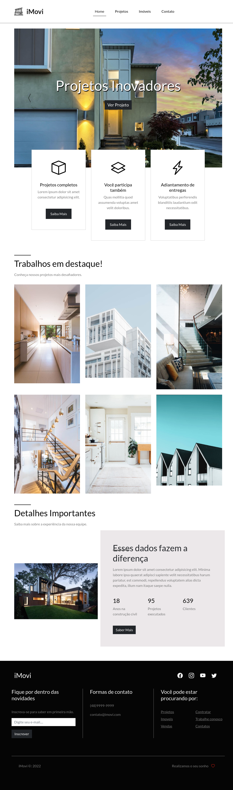

# Aula bootstrap projeto iMovi
 

## *Curso fundamentos de Bootstrap 2021*

___Projeto elaborado por: 
Matheus Battisti - Hora de Codar.___

 
***
 
 [Clique aqui para acessar !]()

 # Tecnologias usadas!

 - HTML
 - CSS
 - Git e GitHub
 - Bootstrap
 ***
